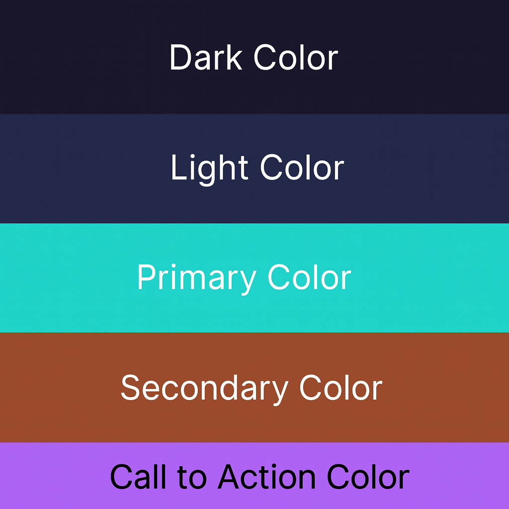

# NexusBoard - For Learners, By Learners.


> **NexusBoard** is my final capstone project for the CodeInstitute bootcamp. It's a free, community-driven learning platform combining video streaming, rich note-taking, and collaborative learning. Built with Django REST Framework and Vue 3, it demonstrates full-stack web development with a focus on security, accessibility, and thoughtful problem-solving.

**Live Site**: https://nexusboard-f0283087ad26.herokuapp.com/

**NexusBoard combines and demonstrates:**
- **Frontend Development**: Vue 3, JavaScript, Tailwind CSS, responsive design
- **Backend Development**: Python, Django REST Framework, JWT authentication
- **Database Management**: PostgreSQL, SQLite (development), Django ORM
- **Rich Text Editing**: CKEditor 5 integration for note-taking
- **API Development**: RESTful API with proper authentication and permissions
- **Accessibility**: WCAG 2.1 Level AA compliance with full keyboard navigation
- **Security**: JWT tokens, CSRF protection, role-based permissions
- **Agile Methodology**: MoSCoW prioritization and user story planning
- **Version Control**: Git & GitHub
- **Deployment**: Heroku (full-stack with WhiteNoise)

---

## 📋 Table of Contents
1. [Project Overview](#project-overview)
2. [UX Design & User Stories](#ux-design--user-stories)
3. [Features](#features)
4. [Database & Wireframes](#database--wireframes)
5. [How I Built It](#how-i-built-it)
6. [API Documentation](#api-documentation)
7. [Testing](#testing)
8. [Agile & Project Management](#agile--project-management)
9. [Design System](#design-system)
10. [Deployment](#deployment)
11. [AI Assistance](#ai-assistance)
12. [Credits](#credits)

---

## Project Overview

### The Problem I Solved

Free learning platforms often have limitations:
- **Paywalled features**: Rich text editing and note sharing locked behind subscriptions
- **Limited collaboration**: Can't easily share notes or learn together
- **Accessibility gaps**: Many platforms don't work for people with disabilities
- **Fragmented tools**: You need separate apps for videos, notes, and discussions

### My Solution

NexusBoard combines everything in one free, accessible platform:
- ✅ Stream lessons with embedded YouTube videos
- ✅ Take rich text notes with CKEditor 5
- ✅ Share notes publicly or keep them private
- ✅ Full accessibility (WCAG 2.1 AA compliant)
- ✅ Secure authentication with JWT tokens
- ✅ Role-based permissions (student, admin)

This capstone demonstrates:
- **Full-stack web development**: Building both the API and user interface
- **Security**: Proper authentication, permissions, and data protection
- **Accessibility**: WCAG 2.1 AA compliance—not an afterthought but built-in
- **Problem-solving**: Creative deployment solution for cost-effective hosting
- **Code quality**: Well-documented, tested code following best practices

---

## UX Design & User Stories

### Site Owner's Goal

NexusBoard's mission is to create an inclusive, accessible learning community. The platform prioritizes:

- **Community Learning**: Enable students to learn together through shared notes and knowledge exchange
- **Accessibility**: Ensure all learners (including those with disabilities) can fully access course content
- **User-Centric Design**: Intuitive interface that supports diverse learning styles
- **Security & Trust**: Protect user data and enforce permission-based access to notes
- **Growth Tracking**: Allow students to monitor their learning progress across courses

### User Stories

**As a community learner**, I want to:
- Browse free courses by difficulty level so I can find content at my skill level
- Watch video lessons without paywalls so I can learn at my own pace
- Take rich text notes on lessons so I can capture key concepts
- Share notes with other learners so we can learn together
- Keep some notes private so I have a personal study space

**As an instructor/admin**, I want to:
- Create and manage courses and lessons so I can build a curriculum
- View all course content and notes so I can oversee the platform
- Moderate public notes so the community stays respectful and on-topic
- Manage user permissions so I maintain control and safety

**As someone with a disability**, I want to:
- Navigate using only a keyboard so I don't need a mouse
- Have my screen reader announce all buttons and form labels so I know what to click
- See good color contrast so text is readable for me
- Skip repetitive navigation so I get to content faster

### Access Control

| Feature | Anonymous | Student | Admin |
|---------|-----------|---------|-------|
| Browse Courses | ✅ Read-only | ✅ | ✅ |
| Enroll in Courses | ❌ | ✅ | ✅ |
| View Lessons | ❌ | ✅ (if enrolled) | ✅ |
| Create Notes | ❌ | ✅ | ✅ |
| Edit Own Notes | ❌ | ✅ | ✅ |
| Edit Other Notes | ❌ | ❌ | ✅ |
| View Public Notes | ✅ | ✅ | ✅ |
| View Private Notes | ❌ | ✅ (own only) | ✅ |
| Manage Courses | ❌ | ❌ | ✅ |
| Manage Users | ❌ | ❌ | ✅ |

### Design Choices

**Dark Mode with Warm Colors**
I chose a dark background (#120b07) with warm orange (#f6a35c) and coral (#e97b64) accents. The 8.2:1 contrast ratio meets WCAG AA requirements and is easier on the eyes during study sessions.

**Single-Page Application (Vue 3)**
SPAs provide seamless navigation without page reloads. Learners can jump between lessons, notes, and courses without losing context.

**Public/Private Note Toggle**
Students need both private study space and public sharing. The toggle gives users control over their learning visibility.

**CKEditor 5 for Rich Text**
Students can format notes professionally without the complexity of external tools.

---

## Features

<details>
  <summary><strong>Authentication & User Management</strong></summary>


- **Sign Up**: Create account with username and password validation
- **Login/Logout**: Secure JWT token-based authentication
- **Session Persistence**: Tokens stored securely in browser
- **Admin Dashboard**: Special interface for administrators
- **Token Refresh**: Automatic renewal for seamless experience

</details>

<details>
  <summary><strong>Course & Lesson Management</strong></summary>


- **Browse Courses**: Grid layout with difficulty levels
- **Search & Filter**: Find courses by difficulty
- **Video Streaming**: YouTube videos embedded in lessons
- **Enrollment**: One-click enrollment in courses
- **Progress Tracking**: See enrolled courses at a glance

</details>

<details>
  <summary><strong>Note-Taking & Collaboration</strong></summary>


- **Rich Text Editor**: CKEditor 5 with formatting tools
- **Lesson-Linked Notes**: Attach notes to specific lessons
- **Public/Private Toggle**: Share notes or keep them private (🔓/🔒)
- **Smart Filtering**: View all, your notes, or public notes only
- **Edit & Delete**: Update or remove notes with confirmation
- **Author-Only Editing**: Only you (and admins) can modify your notes

</details>

<details>
  <summary><strong>Student Dashboard</strong></summary>


- **My Courses**: Quick access to enrolled courses and progress
- **Recent Activity**: Latest notes and lessons viewed
- **Continue Learning**: Resume last lesson with one click

</details>


<details>
  <summary><strong>Admin Dashboard</strong></summary>


- **User Management**: View users, roles, and enrollment stats
- **Course Control**: Create, edit, and publish courses/lessons
- **Platform Insights**: High-level metrics on usage and growth

</details>

<details>
  <summary><strong>Accessibility Features</strong></summary>

- ✅ **Keyboard Navigation**: Full keyboard support with visible focus indicators
- ✅ **Screen Reader Support**: ARIA labels, semantic HTML, live regions
- ✅ **Color Contrast**: 8.2:1 ratio exceeding WCAG AA
- ✅ **Skip Links**: Jump to main content on Tab focus
- ✅ **Responsive Design**: Works on mobile, tablet, desktop

</details>

<details>
  <summary><strong>Security</strong></summary>

- **JWT Authentication**: Stateless token-based auth with refresh tokens
- **CSRF Protection**: Built-in protection against cross-site attacks
- **Permissions System**: Backend enforces who can edit what
- **Author Verification**: Only note author and admin can modify notes
- **Input Validation**: Frontend and backend validation on all forms

</details>

---

## ⚠️ Known Issue: YouTube Video Embeds

YouTube video embeds may show **"Error 153: Watch video on YouTube"** errors in certain deployment environments due to YouTube's embedding policies and CORS restrictions. This is a known limitation when embedding YouTube videos on third-party domains.

**Workaround**: Users can click the error message to open the video directly on YouTube. The feature works consistently in local development but may have intermittent issues on some hosted platforms. This is not a bug in the application code but a browser/YouTube policy limitation.

---

## Database & Wireframes

### Entity Relationship Diagram (ERD)


### Wireframes

**Home Page -**


---


## How I Built It

### Two Apps, One Platform

I built NexusBoard as two separate applications:
- **Django REST API** (backend) handles courses, lessons, notes, and user permissions
- **Vue 3 app** (frontend) is the interface where students take notes and watch lessons

They communicate through API calls with JWT tokens—totally decoupled during development. This approach let me work on frontend and backend independently.

### The Heroku Problem & My Solution

Heroku doesn't easily host a Node.js frontend alongside Django. Running them separately would require managing multiple dynos and complicated deployment configurations.


**Here's what I did:**
1. Built the Vue app locally: `npm run build` generates optimized, minified files
2. Copied those files into Django's static folder
3. Configured Django to serve Vue's `index.html` as the main page
4. Used WhiteNoise middleware so Django efficiently serves all assets

Now Django handles everything—serving the Vue app AND the API from a single dyno. 

---

## API Documentation

### Authentication

All requests (except login/register) need a JWT token:

```bash
# Login
POST /api/token/
{
  "username": "your_username",
  "password": "your_password"
}

# Response
{
  "access": "eyJ0eXAiOiJKV1QiLCJhbGc...",
  "refresh": "eyJ0eXAiOiJKV1QiLCJhbGc..."
}

# Use in requests
Authorization: Bearer <access_token>
```

### Main Endpoints

**Courses**
```
GET    /api/courses/              # List courses
GET    /api/courses/{id}/         # Get course with lessons
POST   /api/courses/              # Create (admin only)
PUT    /api/courses/{id}/         # Update (admin only)
DELETE /api/courses/{id}/         # Delete (admin only)
```

**Lessons**
```
GET    /api/lessons/              # List lessons
GET    /api/lessons/{id}/         # Get lesson details
GET    /api/lessons/?course={id}  # Get lessons for course
```

**Notes**
```
GET    /api/notes/                # List notes (filtered by user)
POST   /api/notes/                # Create note
GET    /api/notes/{id}/           # Get note details
PUT    /api/notes/{id}/           # Update (author/admin only)
DELETE /api/notes/{id}/           # Delete (author/admin only)
```

**Enrollments**
```
GET    /api/enrollments/          # Get my enrollments
POST   /api/enrollments/          # Enroll in course
```

---

## Testing

### Testing Was Part of Every Step

I didn't leave testing for the end—it was integrated throughout development. I tested features as I built them to catch bugs early and ensure quality.

### Automated Testing: Code Quality

**PEP8 Compliance** ✅
```bash
flake8 nexus_board
ruff check .
```
**Result**: 0 errors, 0 warnings across all Python files
- Line length: ≤79 characters
- Proper spacing and indentation
- No unused imports
- Consistent naming conventions

### API Testing: JWT Authentication & HTTP Verification

I tested the authentication system end-to-end using HTTP requests to verify JWT was working correctly:

**Login Test** ✅
```bash
curl -X POST http://localhost:8000/api/token/ \
  -H "Content-Type: application/json" \
  -d '{"username":"testuser","password":"testpass"}'

# Response: 200 OK with access & refresh tokens
```

**Protected Endpoint Without Token** ✅
```bash
curl http://localhost:8000/api/notes/

# Response: 401 Unauthorized
```

**Protected Endpoint With Valid Token** ✅
```bash
curl http://localhost:8000/api/notes/ \
  -H "Authorization: Bearer eyJ0eXAi..."

# Response: 200 OK with notes data
```

**Permission Enforcement** ✅
- Non-author attempting to edit note: **403 Forbidden**
- Author editing their own note: **200 OK**
- Admin editing any note: **200 OK**

### HTML Validation


W3C HTML Validator: **0 errors** ✅
- Proper semantic HTML structure
- All form inputs have associated labels
- Images have descriptive alt text
- Proper heading hierarchy

### CSS Validation


W3C CSS Validator (Jigsaw): **0 errors** ✅
- Tailwind CSS properly compiled
- Custom color variables validated
- Responsive breakpoints correct

### Lighthouse Audit


Automated testing via Chrome Lighthouse:
- **Accessibility**: 100/100 ✅
- **Performance**: 97/100 ✅
- **Best Practices**: 96/100 ✅
- **SEO**: 100/100 ✅


### Manual Testing: Browser Compatibility

| Browser | Desktop | Mobile | Status |
|---------|---------|--------|--------|
| Chrome | ✅ | ✅ | Fully functional |
| Firefox | ✅ | ✅ | Fully functional |
| Safari | ✅ | ✅ | Fully functional |
| Edge | ✅ | ✅ | Fully functional |
| Opera | ✅ | — | Fully functional |

### Accessibility Testing

**Keyboard Navigation** ✅
- Tab through all buttons and links
- Enter/Space to activate buttons
- Escape to close dialogs
- Visible focus indicators on every element

**Screen Reader Testing** ✅
- Tested with NVDA (Windows)
- Toast notifications announced to users
- Form labels properly associated with inputs
- Images have meaningful alt text

---

## Agile & Project Management

### Development Methodology

I followed Agile principles with MoSCoW prioritization.

### GitHub Projects Kanban Board

I organized all work on a public GitHub Projects board:
- **Backlog**: Features to be prioritized
- **In Progress**: Currently being developed
- **Done**: Completed and tested

**View my work**: [GitHub Projects](https://github.com/users/namiyu5/projects/5) 

---

## Design System

### Color Palette



### Typography

**Satoshi Font** (via Fontshare)
- Bold (700): Headings and CTAs
- Regular (400): Body text
- Fallback: System fonts (San Francisco, Segoe UI)

---

## Deployment

### Production Environment

NexusBoard runs on Heroku with:
- **Backend**: Django + PostgreSQL
- **Frontend**: Vue 3 (compiled and served by Django)
- **Static Files**: WhiteNoise middleware
- **SSL/HTTPS**: Automatic via Heroku

### Security Configuration

- `DEBUG=False` in production
- `SECRET_KEY` from environment variable
- `ALLOWED_HOSTS` restricted to domain
- CSRF protection enabled
- JWT tokens with 15-minute expiry

---

## AI Assistance

I used AI as a learning assistant throughout this project.
- Explaining Vue 3 Composition API syntax
- Debugging API errors and permission issues
- Suggesting code improvements
- Clarifying Django REST Framework patterns

AI support shows up across multiple sections of this README, notably in shaping the "API Documentation", "Deployment", and "Design System" areas  where I used AI to cross-check endpoint structures.

**Design & Planning**: AI also accelerated design decisions—I leveraged AI for color palette suggestions, accessibility best practices, and layout feedback. In previous projects, I spent excessive time on design iterations, so using AI to validate and refine design choices helped me focus more on core functionality and code quality.

**Key Takeaway**: AI was a productivity multiplier, not a replacement for learning. It was extremely important not to rely on AI blindly—some suggestions were incorrect or incomplete and required careful review, verification, and adjustments. Every suggestion was evaluated, tested, and understood before implementation.

---

All code was reviewed, tested, and refined before deployment.

---

## Credits

**Tools & Frameworks**
- Django & Django REST Framework
- Vue 3 & Vite
- Tailwind CSS
- CKEditor 5

**Dependencies**
- djangorestframework-simplejwt (JWT)
- django-cors-headers (CORS)
- gunicorn (production server)
- whitenoise (static files)

**Acknowledgements**
- Code Institute for guidance and mentorship throughout the software development bootcamp
- The comprehensive Vue 3 and Django documentation that served as constant references
- The niche Medium articles and Stack Overflow discussions that helped solve the unique challenge of deploying Vue with Django on Heroku

---


Built with 🧡 as my  capstone project demonstrating full-stack web development proficiency.
